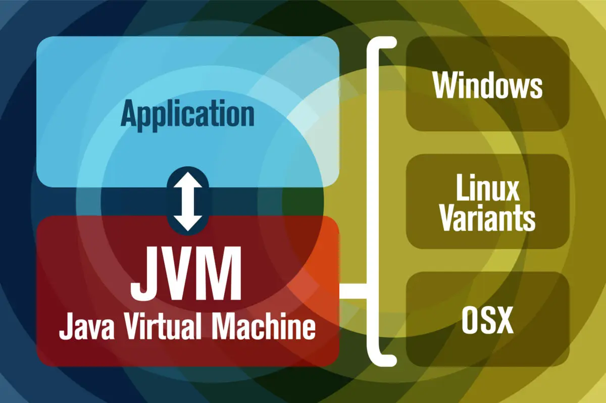
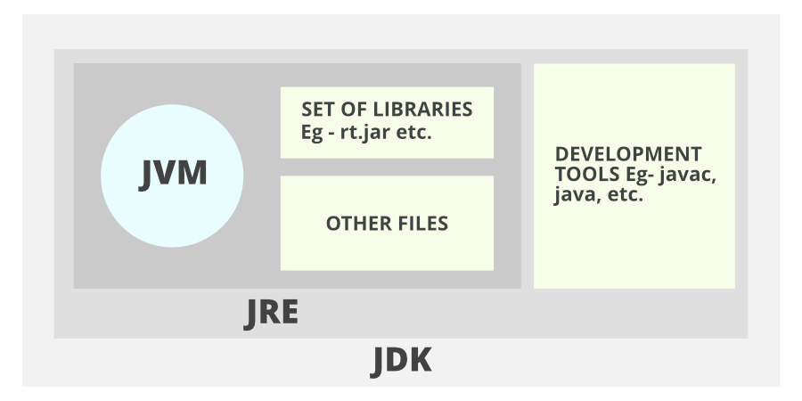

### What is JVM? 

https://www.infoworld.com/article/3272244/what-is-the-jvm-introducing-the-java-virtual-machine.html
* JVM(Java Virtual Machine) acts as a run-time engine to run Java applications. JVM is the one that actually calls the main method present in a java code. JVM is a part of JRE(Java Runtime Environment).

* Java applications are called WORA (Write Once Run Anywhere). This means a programmer can develop Java code on one system and can expect it to run on any other Java-enabled system without any adjustment. This is all possible because of JVM.

* When we compile a .java file, .class files(contains byte-code) with the same class names present in .java file are generated by the Java compiler. This .class file goes into various steps when we run it. These steps together describe the whole JVM.
  https://www.geeksforgeeks.org/jvm-works-jvm-architecture/
### Why is Java called the ‘Platform Independent Programming Language’?

### What is the difference between JDK and JRE?

1. JDK (Java Development Kit) is a Kit that provides the environment to develop and execute(run) the Java program. JDK is a kit(or package) that includes two things

   Development Tools(to provide an environment to develop your java programs)
   JRE (to execute your java program).

2. JRE (Java Runtime Environment) is an installation package that provides an environment to only run(not develop) the java program(or application)onto your machine. JRE is only used by those who only want to run Java programs that are end-users of your system.

3. JVM (Java Virtual Machine) is a very important part of both JDK and JRE because it is contained or inbuilt in both. Whatever Java program you run using JRE or JDK goes into JVM and JVM is responsible for executing the java program line by line, hence it is also known as an interpreter.

https://www.geeksforgeeks.org/differences-jdk-jre-jvm/

### What are the data types supported by Java? What are autoboxing and unboxing?
Example

* int myNum = 5;               // Integer (whole number)
* float myFloatNum = 5.99f;    // Floating point number
* char myLetter = 'D';         // Character
* boolean myBool = true;       // Boolean
* String myText = "Hello";     // String

Primitive data types - includes byte, short, int, long, float, double, boolean and char
Non-primitive data types - such as String, Arrays and Classes

https://www.w3schools.com/java/java_data_types.asp

Autoboxing and Unboxing

Autoboxing is the automatic conversion that the Java compiler makes between the primitive types and their corresponding object wrapper classes. For example, converting an int to an Integer, a double to a Double, and so on. If the conversion goes the other way, this is called unboxing.

Consider the following code:
```
List<Integer> li = new ArrayList<>();
for (int i = 1; i < 50; i += 2)
li.add(i);
```
Although you add the int values as primitive types, rather than Integer objects, to li, the code compiles. Because li is a list of Integer objects, not a list of int values, you may wonder why the Java compiler does not issue a compile-time error. The compiler does not generate an error because it creates an Integer object from i and adds the object to li. Thus, the compiler converts the previous code to the following at runtime:
```
List<Integer> li = new ArrayList<>();
for (int i = 1; i < 50; i += 2)
li.add(Integer.valueOf(i));
```
Converting a primitive value (an int, for example) into an object of the corresponding wrapper class (Integer) is called autoboxing. The Java compiler applies autoboxing when a primitive value is:

* Passed as a parameter to a method that expects an object of the corresponding wrapper class.
* Assigned to a variable of the corresponding wrapper class.

Converting an object of a wrapper type (Integer) to its corresponding primitive (int) value is called unboxing. The Java compiler applies unboxing when an object of a wrapper class is:

* Passed as a parameter to a method that expects a value of the corresponding primitive type.
* Assigned to a variable of the corresponding primitive type.

The Unboxing example shows how this works:

```
import java.util.ArrayList;
import java.util.List;

public class Unboxing {

    public static void main(String[] args) {
        Integer i = new Integer(-8);

        // 1. Unboxing through method invocation
        int absVal = absoluteValue(i);
        System.out.println("absolute value of " + i + " = " + absVal);

        List<Double> ld = new ArrayList<>();
        ld.add(3.1416);    // Π is autoboxed through method invocation.

        // 2. Unboxing through assignment
        double pi = ld.get(0);
        System.out.println("pi = " + pi);
    }

    public static int absoluteValue(int i) {
        return (i < 0) ? -i : i;
    }
}
```
The program prints the following:
```
absolute value of -8 = 8
pi = 3.1416
```
https://docs.oracle.com/javase/tutorial/java/data/autoboxing.html

### What are constructors, constructor overloading and copy-constructor in Java?
https://www.javatpoint.com/java-constructor

### What is the difference between throw and throws in Java exception handling?
### Does Java support multiple inheritance?
### What are pass-by-reference and pass-by-value?
### What are the basic interfaces of Java Collections Framework?
### What is the difference between Array and ArrayList? When will you use Array over ArrayList?
### What is the difference between an ArrayList and a LinkedList?
### How can you use Comparator and Comparable?
### What is a StringBuilder, how do you use it and why?
### What is JDBC?